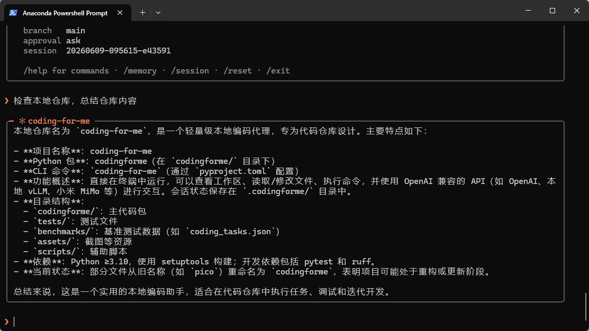

# coding-for-me

> 把一个会写代码的助手,装进你的仓库里——它在终端里,看得见你的文件,改得动你的代码。



这就是 `coding-for-me` 的全部体验:一个提示符,一句话,它去读、去改、去跑,然后把结果摆在你面前。没有 IDE 插件,没有网页,没有上下文丢失——只有终端和你的仓库。

---

## 它做这些

- **修测试。** 你说哪个挂了,它去看 traceback、定位、改代码、再跑一遍。
- **改现有代码。** 基于仓库里真实存在的文件做小步迭代,而不是凭空生成一段你还得自己拼进去的片段。
- **读懂一个陌生仓库。** 进去转一圈,告诉你结构、入口、关键约定在哪。
- **跑一次性任务。** 重命名、补类型、改配置——一条命令,一次性搞定。
- **记住上下文。** 关掉再回来,`--resume latest` 接着上次继续。

## 它不做这些

- 不是聊天框。它的每句话背后都对应一次真实的文件读写或命令执行。
- 不偷偷跑命令。`run_shell` / `write_file` / `patch_file` 默认每一步都问过你才动手。
- 不绑定某一家模型。任何 OpenAI 兼容的 `/chat/completions` 端点都能接。
- 不拖一堆依赖。运行时只用 Python 标准库,装上就能跑。

---

## 三步上手

```bash
# 1. 装(需要 Python 3.10+)
uv sync                 # 或者 pip install -e .

# 2. 配一个模型
cp .env.example .env    # 然后把下面三行填进去

# 3. 在仓库里开跑
uv run coding-for-me
```

`.env` 里要填的三行:

```bash
CODINGFORME_OPENAI_API_BASE="https://your-api.example/v1"
CODINGFORME_OPENAI_API_KEY="your-api-key"
CODINGFORME_OPENAI_MODEL="your-model"
```

> 用小米 MiMo?把 base 换成 `https://token-plan-cn.xiaomimimo.com/v1`、模型填 `mimo-v2.5` 就行。
> 谁都不填时,默认指向 `https://www.right.codes/codex/v1` 的 `gpt-5.4`。
> 优先级:命令行 `--model` / `--base-url` > `.env` 里的 `CODINGFORME_OPENAI_*` > 裸 `OPENAI_*` > 代码默认。

## 几种用法

```bash
uv run coding-for-me                         # 交互模式(REPL)
uv run coding-for-me "把 README 里的死链修掉" # 说完就跑,跑完就退
uv run coding-for-me --cwd /path/to/repo     # 对另一个仓库下手
uv run coding-for-me --resume latest         # 接着上次的会话
python -m codingforme                        # 等价的模块入口
```

进了 REPL,这几个命令随时可用:`/help` `/memory`(看它记住了什么)`/session`(会话文件在哪)`/reset`(清空重来)`/exit`。

## 想再拧几个旋钮

| 旋钮 | 干什么 | 默认 |
|---|---|---|
| `--approval` | 高风险工具是 `ask` 逐个问 / `auto` 自动 / `never` 不许 | `ask` |
| `--max-new-tokens` | 模型**每一步**最多吐多少 token | `512` |
| `--max-steps` | 一次请求里最多迭代几轮工具 | `6` |
| `--temperature` | 采样温度 | `0.2` |
| `--model` / `--base-url` | 临时换模型 / 换端点,不动 `.env` | 取自 `.env` |
| `--resume` | 会话 id,或 `latest` | 无 |

> 回答被截断了?多半是 `--max-new-tokens` 默认 512 偏小——它是单步硬上限。写长代码时调到 `2048` 试试。

---

## 幕后:它信不过自己

这个 agent 的设计前提是「模型会犯错」,所以护栏不在模型那边,在平台这边:

- **危险操作要过闸。** 所有工具调用都先经过一个总闸口,审批策略说了不算就是不算;`patch_file` 还要求 `old_text` 在文件里唯一匹配,改不准就拒绝。
- **子任务只读。** 它派生出去的子 agent 一律只读、不许审批、步数预算更小——能看不能动。
- **环境是过滤过的。** `run_shell` 只拿到一份白名单环境变量,密钥名会被脱敏,不会把你的完整 env 漏给子进程。
- **一切留痕。** 每次运行都在 `.codingforme/runs/<run_id>/` 落下 `trace.jsonl`(逐事件追加,跑一半也能看)、`task_state.json`、`report.json`;写进去之前,密钥的值已经换成 `<redacted>`。

会话本身存在 `.codingforme/sessions/`,这些本地产物都被 `.gitignore` 挡在仓库之外。

有意思的一点:**`coding-for-me` 的开发对象就是它自己。** 仓库里大量测试,是把这个 agent 放进 `tests/fixtures/` 的样板仓库里跑出来的。

## 改它 / 测它

```bash
uv run pytest            # 全量测试
uv run ruff check .      # lint
```

源码里的注释是中文,标识符和 CLI 文案是英文——动手改的时候,跟着这个习惯走。
